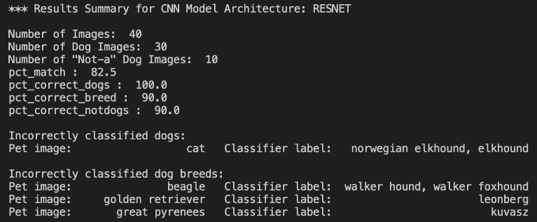

# Dog Breed Detection Using CNN Models

## About the Project
This project is a component of the AWS AI/ML Scholarship Program's AI Programming with Python Nanodegree. It aims to identify dog breeds from images by leveraging pre-trained Convolutional Neural Networks (CNNs) including ResNet, AlexNet, and VGG. The workflow includes extracting breed labels from image filenames, utilizing CNNs for classification, and evaluating each model's performance.

## Project Components
The project is divided into the following modules:

- **Image Classification**: 
  - `check_images.py`: Classifies images of pets using pre-trained CNN models.
  - `classify_images.py`: Performs the classification of pet images based on the chosen CNN model.

- **Utility Scripts**:
  - `get_input_args.py`: Manages command-line arguments for flexible script execution.
  - `get_pet_labels.py`: Extracts breed labels from image filenames.

- **Results Management**:
  - `adjust_results4_isadog.py`: Modifies the results to specify whether the labels are dogs.
  - `calculates_results_stats.py`: Computes statistical data for the classification results.
  - `print_results.py`: Displays a summary of the classification outcomes, highlighting any misclassifications.

- **Auxiliary Functions**:
  - `print_functions_for_lab_checks.py`: Contains utility functions to facilitate debugging and lab verification.
  - `dognames.txt`: A text file listing all recognized dog names.

## How to Execute
To run the project, follow these steps:

1. Open your terminal or command prompt.
2. Navigate to the project directory.
3. Execute the following command:

   ```
   python check_images.py --dir <path_to_images> --arch <model_architecture> --dogfile dognames.txt

   ```
## Output

Upon execution, the project generates a summary including:

- Total Number of Images
- Total Number of Dog Images
- Total Number of Non-Dog Images
- Accuracy of Dog Identification
- Accuracy of Breed Identification
- Accuracy of Non-Dog Classification
- Overall Match Percentage
The results are broken down by model (ResNet, AlexNet, VGG), showing counts for correctly identified dogs and breeds. Misclassifications, if any, are also reported.

## RESNET



## ALEXNET


## VGG


## Acknowledgments
This project is a part of the AWS AI/ML Scholarship Program's AI Programming with Python Nanodegree. Special thanks to our mentor for their support and contributions.


